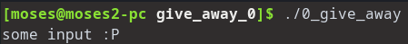
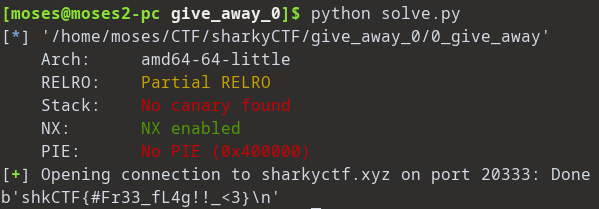

# SharkyCTF 2020 – Give away 0

* **Category:** PWN
* **Points:** 160

## Challenge

> Home sweet home.
>
> Creator: Hackhim
>
> nc sharkyctf.xyz 20333
>
> attachments :
>
> binary : 0_give_away

## Solution

First we mark the binary executable so we can run it:
`chmod +x 0_give_away`

when we try running the binary it accepts some input and then it exits



so we disassemble the binary with `objdump -d 0_give_away`:

```
00000000004006a7 <win_func>:
  4006a7:	55                   	push   %rbp
  4006a8:	48 89 e5             	mov    %rsp,%rbp
  4006ab:	ba 00 00 00 00       	mov    $0x0,%edx
  4006b0:	be 00 00 00 00       	mov    $0x0,%esi
  4006b5:	48 8d 3d d8 00 00 00 	lea    0xd8(%rip),%rdi        # 400794 <_IO_stdin_used+0x4>
  4006bc:	e8 6f fe ff ff       	callq  400530 <execve@plt>
  4006c1:	90                   	nop
  4006c2:	5d                   	pop    %rbp
  4006c3:	c3                   	retq   

00000000004006c4 <vuln>:
  4006c4:	55                   	push   %rbp
  4006c5:	48 89 e5             	mov    %rsp,%rbp
  4006c8:	48 83 ec 20          	sub    $0x20,%rsp
  4006cc:	48 8b 15 7d 09 20 00 	mov    0x20097d(%rip),%rdx        # 601050 <stdin@@GLIBC_2.2.5>
  4006d3:	48 8d 45 e0          	lea    -0x20(%rbp),%rax
  4006d7:	be 32 00 00 00       	mov    $0x32,%esi
  4006dc:	48 89 c7             	mov    %rax,%rdi
  4006df:	e8 3c fe ff ff       	callq  400520 <fgets@plt>
  4006e4:	90                   	nop
  4006e5:	c9                   	leaveq 
  4006e6:	c3                   	retq   

00000000004006e7 <main>:
  4006e7:	55                   	push   %rbp
  4006e8:	48 89 e5             	mov    %rsp,%rbp
  4006eb:	b8 00 00 00 00       	mov    $0x0,%eax
  4006f0:	e8 51 ff ff ff       	callq  400646 <init_buffering>
  4006f5:	b8 00 00 00 00       	mov    $0x0,%eax
  4006fa:	e8 c5 ff ff ff       	callq  4006c4 <vuln>
  4006ff:	b8 00 00 00 00       	mov    $0x0,%eax
  400704:	5d                   	pop    %rbp
  400705:	c3                   	retq   
  400706:	66 2e 0f 1f 84 00 00 	nopw   %cs:0x0(%rax,%rax,1)
  40070d:	00 00 00 

```

we see that the main is calling the vuln function which reads 0x32 bytes using fgets and store them in rbp-0x20
so we can overwrite the return address with offset '0x20+0x8=0x28=40'
and we overwrite it with the address of win function 'win_func' which obviously pops a shell

I like to use pwntools template to automate the process: [solve.py](solve.py)



WE GOT THE FLAG :)
```
shkCTF{#Fr33_fL4g!!_<3}
```
