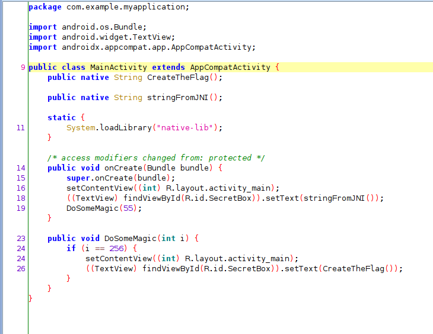
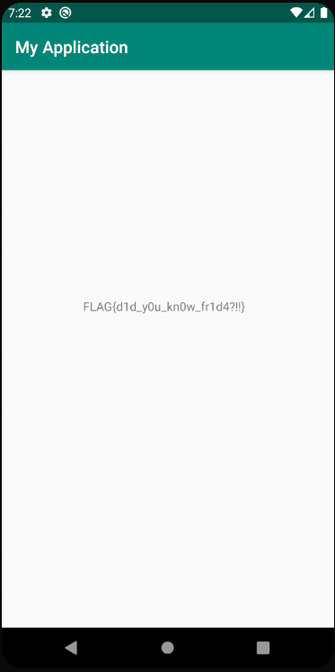

# SyriaCTF – HookMe

* **Category:** Malware Reverse Engineering
* **Points:** 100

we open the apk file in jadx :

we see that the function that is necessary for creating the flag will not run because i is not 256

so unpacked the apk using apktool : `apktool d HookMe.apk`

then I edited the smali file to change i value to 256 then I rebuild the apk : `apktool b HookMe`

but the apk didn't work because it was not signed

after hours of research I found a way to generate a key and get the apk signed :

`keytool -genkey -keystore my-release-key.keystore -alias key0`

`jarsigner -keystore my-release-key.keystore HookMe.apk key0`

then after running the apk on an emulator it spits out the flag

no actually I don't :)

solved by b4n4n4s