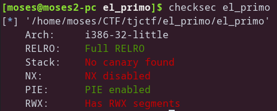
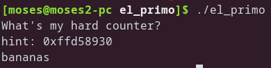
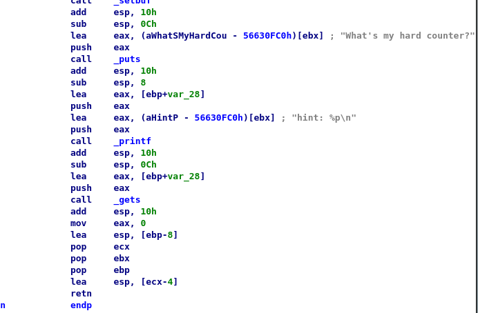

# TJCTF – El Primo

* **Category:** binary
* **Points:** 60

## Challenge

> My friend just started playing Brawl Stars and he keeps raging because he can't beat El Primo! Can you help him?
>
> Attachments:
> > binary
> >
> > nc p1.tjctf.org 8011

## Solution

ok this time we have a pie protected 32-bit binary :



hmmm lets run and reverse the binary to see what we can do :





cool, it seems that this hint is the address of the input in the stack, but wait we can't just overflow and inject a shellcode because of the last couple instructions :

it pops ecx from the stack, then it changes esp to ecx-4, so we have to let it pop the address of the intended return address in the stack+4 so it gets subtracted by 4 then the stack pointer points to the intended return address which then the retn instruction pops and returns to

I hope you understand what I just wrote :P

payload :
```
offset
hint+offset+4
hint+offset+16
nop sleds
shellcode
```

here's my [script](solve.py)

```
tjctf{3L_PR1M0O0OOO!1!!}
```
