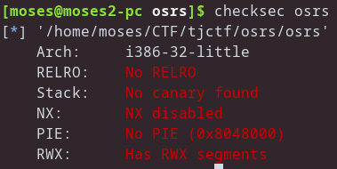
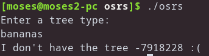
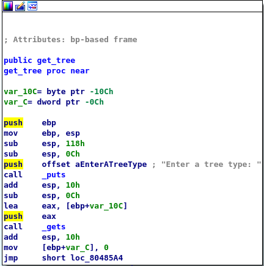
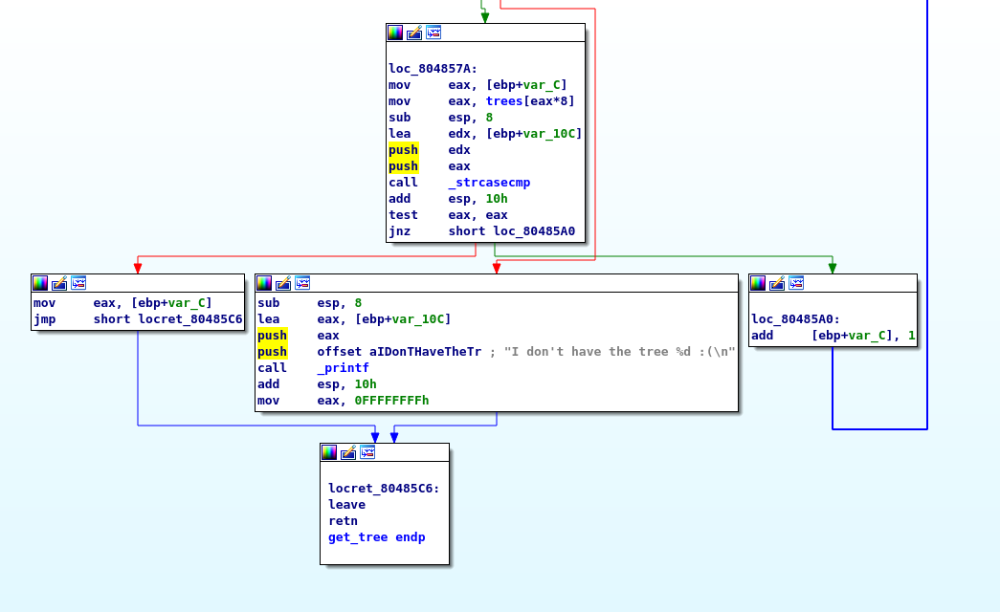

# TJCTF – OSRS

* **Category:** binary
* **Points:** 50

## Challenge

> My friend keeps talking about Old School RuneScape. He says he made a service to tell you about trees.
>
> I don't know what any of this means but this system sure looks old! It has like zero security features enabled...
>
> Attachments :
> > binary
> >
> > nc p1.tjctf.org 8006

## Solution

if we check the security of the binary we see its not secured at all XD :



so lets run the binary and see what it does :



hmmm it gives as a negative number am guessing its an address for something lets see :





wow we see its also using gets XD, hmmm i guess this address is somewhere in the stack cool, we can use that for a shellcode injection

I grabbed a shellcode from shellstorm from [here](http://shell-storm.org/shellcode/files/shellcode-827.php)

so our first payload will be :

```
overflow offset
return to get_tree
```

now we have the stack address we can add it to the offset plus 0x50 to ensure it will land on the nop sleds

so the next payload is :
```
overflow offset
return to "stack address + offset + 0x50"
nop sleds
shellcode
```

so when it returns to that address it will land somewhere on the nop sleds that leads to the shellcode

the script here : [solve.py](solve.py)

```
tjctf{tr33_c0de_in_my_she115}
```

> P.S : Trees are my thing