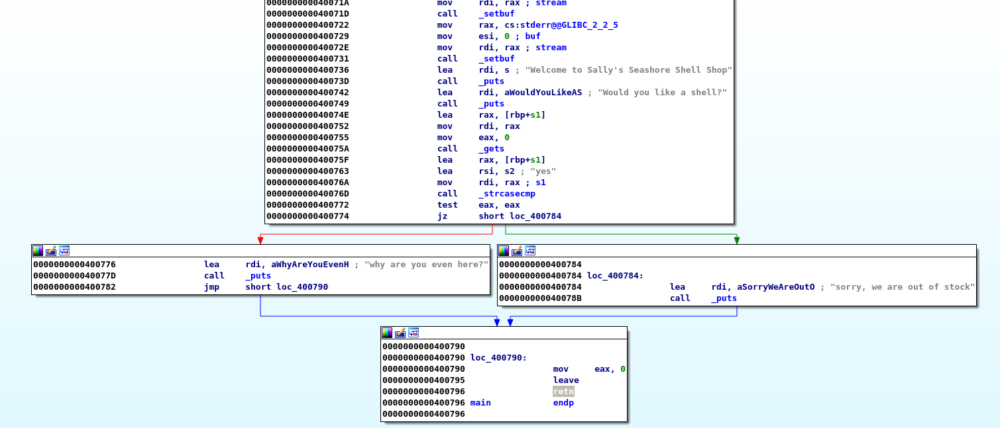
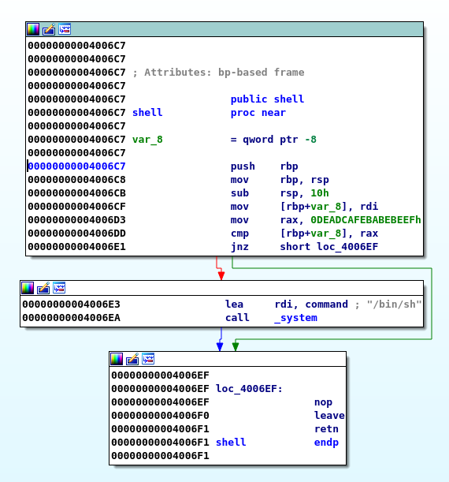

# TJCTF – Seashells

* **Category:** binary
* **Points:** 50

## Challenge

> I heard there's someone selling shells? They seem to be out of stock though...
>
> Attachments:
> > binary
> >
> > nc p1.tjctf.org 8009
## Solution

first thing we do is disassemble the binary, we have to interesting functions :




we can see that the main function is using gets for input (which is a dumb move :P)

and also the shell function which is never called checks an argument then pops a shell

so we conclude that we can use ROP (since its a 64bit binary) to exploit it using this chain :

```
pop rdi
0xDEADCAFEBABEBEEF
shell
```

which is a very simple chain, I wrote a script to help automate the process : [solve.py](solve.py)

tada :
```
tjctf{she_s3lls_se4_sh3ll5}
```

> P.S : had to do repeat the rop chain two times to make it work still don't know why XD