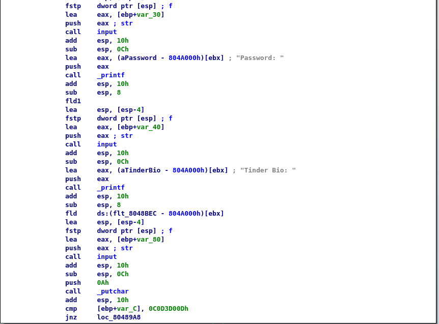
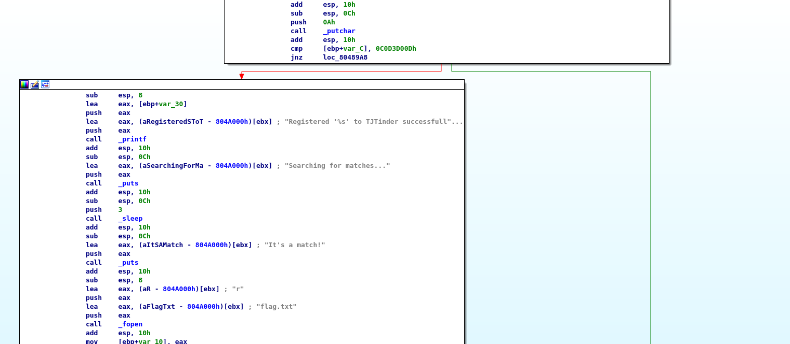

# TJCTF – Tinder

* **Category:** binary
* **Points:** 25

## Challenge

> Start swiping!
> Attachments:
> > binary
> > nc p1.tjctf.org 8002

## Solution

if we dissassemble the binary we see a cmp instruction that leads to the flag :




btw `var_C = 0`

and we see that it reads before the bio at `ebp-0x80` and then compares the integer at `ebp` with `0x0C0D3D00D`

so by playing around to find the exact offset which is `0x74`

I wrote a [script](solve.py) using pwntools to get a match (I mean the flag)

```
tjctf{0v3rfl0w_0f_m4tch35}
```
