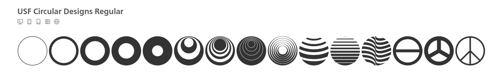

# TJCTF – Circles

* **Category:** crypto
* **Points:** 10

## Challenge

> Some typefaces are mysterious, like this one - its origins are an enigma wrapped within a riddle, indeed.
>
> Attachments:
> > 
>
> hint :
> > To obtain the flag, you should find the font that was used to encode the message in the picture. If you Google the description of the problem, the first website that pops up seems promising. Using a dictionary to guess/bruteforce words without finding the font will not help you. Each circle in the image represents an alphanumeric character that is part of the flag. The brackets and the underscore in the image are NOT part of the font used to encrypt the flag.

## Solution

we see that following the hint if we googled the description we find a cool website [fonts.com](fonts.com)

if we search for circular fonts we find this one :



then we open the character map and crack the cipher manually:

```
tjctf{B3auT1ful_f0Nt}
```
