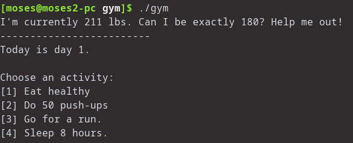
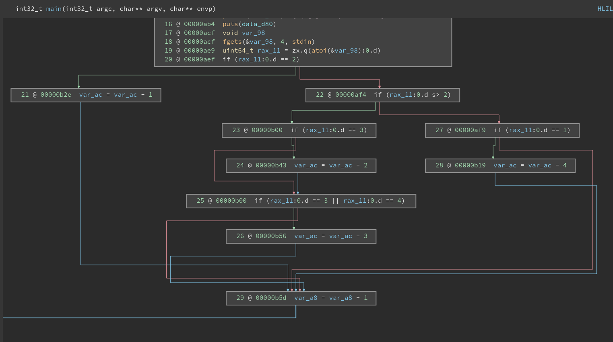

# TJCTF – Gym

* **Category:** reversing
* **Points:** 20

## Challenge

> Aneesh wants to acquire a summer bod for beach week, but time is running out. Can you help him create a plan to attain his goal?
> Attachment :
> > binary
> >
> > nc p1.tjctf.org 8008

## Solution

when we run the binary we see its a gym simulation:



so we see that we have to reach a 180 from 211 thats 31 lbs down

lets disassemble the main function to see what does what :



it seems like each activity has a certain effect on weight :

```
eat healthy : -4
do 50 push-ups : -1
go for a run : -2
sleep 8 hours : -3
```

and we can only do 8 activities

obviously we cant achieve our goal using these number

but we see that for some reason when you go for a run you also sleep for 8 hours (I guess you get tired idk)

so you get an extra `-3` for the run option

in that way we can run for 6 times and then do 50 push ups : `-4*6 -1 = -31`

so by doing only that we get our flag

```
tjctf{w3iGht_l055_i5_d1ff1CuLt}
```
